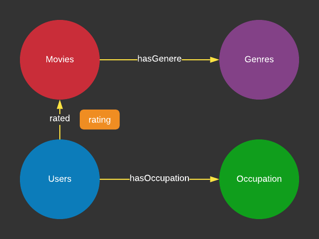

# OrientDbSQLExamples
Various examples to clarify the use of the OrientDB SQL

## What You Will Need

I will be referring to the OrientDB as ODB or OD throughout this document.

After you have set up your ODB, please install the MovieRatings DB. This DB is not installed
out of the box. There is a quick setup for this in the top right corner of your ODB Studio login panel, from where you can load this example DB online into your own instance.

This was written with ODB 3.x. Some of the queries may not work in 2.x.

Please report any bugs in this document or examples via the GitHub Issues on this repo
and you are welcome to contribute
additional queries that might help out other OrientDB users and myself as well. Simply
do a PR from your repo to me.

## Quick Check: List all the movies in ODB

    SELECT FROM Movies
  
## The Graph Entity Relations

* Users can rate movies and they also have occupations
* Movies can be rated by the users and they have genres
* Note that **rated** has one property named `rating` which is a number of 0 to 5. This value is not on the Vertex, 
  but it is on the Edge.

## The Query Collection

### List all the movies a user id 2 has rated

    SELECT EXPAND(OUT("rated")) FROM Users WHERE id=2
  
#### The Key Points
  
* If you forget "rated" in OUT("rated") and did just OUT() you will pull both Occupations and Movies nodes
* If you forget EXPAND() you will get the target record IDs and not actual columns in the movies

### List all the movies rated by people under age 25

    SELECT expand(out("rated")) from Users where age < 25
  
### List all the users who are lawyers. This is the prep for getting movies rated by lawyers.

    SELECT FROM Users where out("hasOccupation").description = "lawyer"

* Note that the Users table also has the occupation id, and the lawyer is id = 11. This is technically rundudant and
  not normalized, but because it's there we can check visually in the ODB Studio.

### List the movies rated by lawyers
  
We will build on the all above examples. The key is to feed the set of users in to the top level query.

    SELECT EXPAND(OUT("rated")) FROM (
      SELECT FROM Users where out("hasOccupation").description = "lawyer"
      
### Same Query but Using Traversal

If you expand this to perform other queries, you will certainly notice the performance hit.

    select from (traverse * from (select from users where id=11)) where @class='Movies'
    
### List all the "Crime" movies that were rated by the lawyers 

I am sure the lawyers would love to see crime movies. 

This is fairly complex even considering that we have only 4 types of edges and 4 types of entities.

1. Get all the users who are the lawyers
2. Get all the movies the lawyers rated
3. Get the lawyer rated movies and have the Genre of "Crime"
4. Bonus sort the movies by title

      SELECT FROM (
      SELECT EXPAND(OUT("rated")) FROM (
          SELECT FROM Users where out("hasOccupation").description = "lawyer")
        ) WHERE OUT("hasGenera").description = "Crime"
      ORDER BY title

#### With Traverse

    select from (traverse * from (
      select * from Occupation where description='lawyer'
      )) where @class='Movies'

#### Tempting, but do not do this. It will take forever!

    select from (traverse * from (
      select * from Occupation where description='lawyer'
      )) where @class='Movies' AND OUT("hasGenera").description = "Crime"
      
Nor this,

    select FROM (
    select from (
      select from (traverse * from (
          select * from Occupation where description='lawyer'
        )) where @class='Movies'
      ) ) WHERE OUT("hasGenera").description = "Crime"

### More on Traverse

Select the Users who are 50 or older who have rated Drama type movies.

    select FROM (
    select From (traverse in() From (
      select from Genres where description="Drama")) where @class="Users")
        WHERE age > 50

## Select the People who rated all Toy Story movies... then do some more on this

### First select all Toy Story movies

There are more than one in the Toy Story database from different release years.  This will
show you all of them.

    SELECT FROM Movies WHERE title LIKE 'Toy Story%'
    
### Next, list the people who rated these

    SELECT expand(in('rated')) FROM Movies WHERE title LIKE 'Toy Story%'

### Of the people who rated "Toy Story" movies what Occupations did they have?

    SELECT expand(out("hasOccupation")) FROM (
        SELECT expand(in('rated')) FROM Movies WHERE title LIKE 'Toy Story%'
      )

### Summarize by type of occupation (use of Group By) who rated Toy Story movies

Here is one way to obtain the answer. 

    SELECT count(out("hasOccupation")) AS C1, out("hasOccupation").description[0] AS D1 FROM (
            SELECT expand(in('rated')) FROM Movies WHERE title LIKE 'Toy Story%'
          ) GROUP BY out("hasOccupation") order by C1 desc

    In my run this resulted in;

        538 college/grad student
        449 other
        341 executive/managerial
        313 technician/engineer

#### Key Points

* This requires ODB 3.x or later. Also note that `GROUP BY` may not work unless you perform
it on the record IDs like

    GROUP BY out("hasOccupation")

* This demonstrates the use of `AS`. Unlike most SQL `ORDER BY 1` would not work.
* The reason for `out("hasOccupation").description[0]` is that if you do not use `[0]`
  the result will be an array of strings. 

### People who liked Toy Story also liked...

We are now using two new things. One is that rated.rating is a property of an edge and not a vertex.

For this to work, also outV() is needed not just out(). This will then list all the expended Users records. 

        select expand(outV()) from rated where rating > 3 and inV().title like "Toy S%"
        
### Find the People who liked GoldenEye who live in the Bay Area and older than 37 years

Check to see Golden Eye was watched by older adults in the Bay Area. Should this have been more detailed data,we can do more specific promotions.

         select expand(outV()) from `rated` WHERE outV().zipCode like "94%" and outV().age > 37 and inV().title like "GoldenEye%" limit 1000

## Next

Now you understand the basics, let's tackle a bit more advanced set of
situations with the [DemoDB travel agency database.](DemoDB-SQLs.md)
    

  
  
